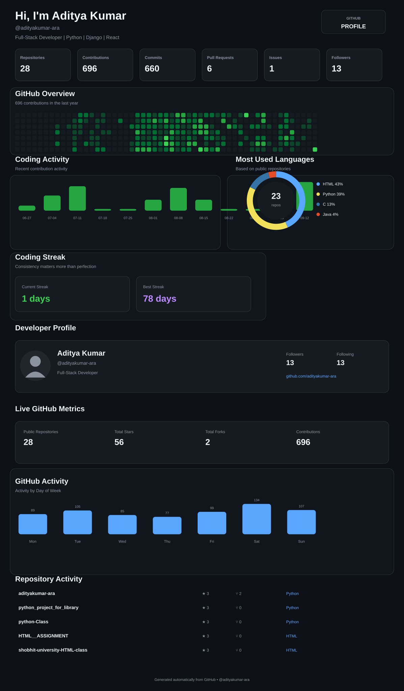

---

## 🐍 GitHub Contribution Snake

---

## 👨‍💻 About Me

- 🎓 BCA Student
- 💻 Aspiring Full-Stack Developer
- 🐍 Python & Django Developer
- 🌐 Learning React and REST APIs
- 📚 Practicing Data Structures & Algorithms
- 🤖 Exploring AI & Machine Learning
- 🚀 Building real-world projects

## 🛠 Technologies & Languages

### 🚀 Featured Project

**✂️ Smart Salon** — Django-based salon booking application.

[View Smart Salon](https://github.com/adityakumar-ara/Smart-Salon)

---

**Code • Learn • Build • Repeat 🚀**

